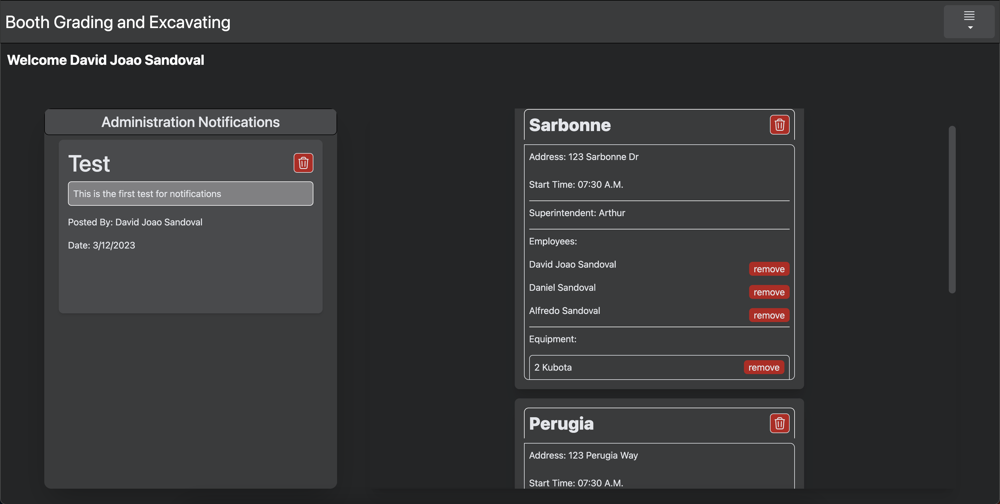

## Getting Started With Booth Grading Employee Panel   

## Deployed Test Site - [CLICK HERE!](https://booth-ge.vercel.app/) -

### Admin Test Account: 
- Email: admintester@booth.com
- Password: boothtesting

### Foreman Test Account: 
- Email: foremantester@booth.com
- Password: boothtesting

### Laborer Test Account: 
- Email: laborertester@booth.com
- Password: boothtesting

### Technologies used:
- NextJS
- MongoDB
- HTML
- React Bootstrap
- TailwindCSS
- Node
- JWT Authentication

### User Stories:
- As an employee, I want to see my assigned jobsite.
- As an employee, I want to be able to see start time, other employees in jobsite, and important notifications.
- As an employee, I want to create an account and log into the portal.
- As an employee, I want to create timesheets fast.
- As a foreman, I want to be able to have access to do daily reports.
- As a administrator, I want to create jobsites, notifications, accessories for equipment, equipment.
- As a administrator, I want to manage employees and add/remove them to different jobsites
- As a administrator, I want to manage equipment and add/remove it to/from jobsites.
- As a administrator, I want to be able to delete users, notifications, timesheets, reports, equipment, accessories.
- As a administrator, I want to be able to see all timesheets and daily reports.

## Screenshots
  
Index

### Admin Account Screenshots

Home

Menu

Manage Employees and Equipment

Manage Equipment

Manage Employees

Posting new jobsites, equipment, accessories, notifications

All daily reports

All timesheets

  

### Foreman Account Screenshots

Foreman Menu

  

### Laborer Account Screenshots

Laborer Home

Laborer Menu

Create Timesheet
